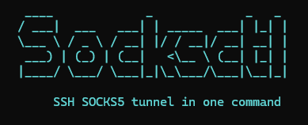

<div align="center">

# socksctl

**Persistent SSH SOCKS5 tunnel — one command setup**

[](LICENSE)
[](https://ubuntu.com)
[](https://debian.org)

**Language / Язык:** [English](#english) · [Русский](#русский)

</div>

---

<p align="center">
  
</p>

<p align="center">
  <sub>Interactive installer: enter VPS IP and password — get <code>socks5h://127.0.0.1:1080</code></sub>
</p>

---

<a id="english"></a>

## English

### What is socksctl?

**socksctl** is a small CLI tool that sets up a **persistent SOCKS5 proxy** on your Linux server through an **SSH tunnel** to an external VPS.

You run one command, enter the **IP** and **password** of your foreign VPS once — socksctl handles everything else:

- installs dependencies (`autossh`, `openssh-client`, …)
- generates an SSH key
- copies the key to the VPS
- creates a **systemd** service with autostart
- verifies the proxy works

**Result:** `socks5h://127.0.0.1:1080` — stable internet exit through your VPS.

**Typical use cases:**

- Access **Telegram Bot API** and other services blocked in your region
- Route server traffic through a foreign IP without a VPN interface
- Quick setup for bots, scrapers, and backend services on Ubuntu/Debian

### How it works

```text
Your app  →  127.0.0.1:1080 (SOCKS5)  →  SSH tunnel  →  VPS  →  Internet
```

> No new network interface is created — only a local port. After reboot the tunnel starts automatically.

### Quick install (one command)

Works on a clean Ubuntu/Debian server as **root**:

```bash
bash -c 'd=$(mktemp -d); curl -fsSL --connect-timeout 30 --max-time 300 --retry 5 https://github.com/Taurus-Silvr/socksctl/archive/refs/heads/main.tar.gz | tar xz -C "$d" --strip-components=1; exec bash "$d/install.sh"'
```

Then enter:

1. **External VPS IP** (e.g. `185.242.247.214`)
2. **root password** (once, not stored)

**Alternative** (unstable network — download first):

```bash
curl -fsSL --connect-timeout 30 --max-time 300 --retry 5 \
  -o /tmp/socksctl.tgz \
  https://github.com/Taurus-Silvr/socksctl/archive/refs/heads/main.tar.gz \
  && mkdir -p /tmp/socksctl-src \
  && tar xzf /tmp/socksctl.tgz -C /tmp/socksctl-src --strip-components=1 \
  && bash /tmp/socksctl-src/install.sh
```

**With sudo** (non-root user):

```bash
sudo bash -c 'd=$(mktemp -d); curl -fsSL --connect-timeout 30 --max-time 300 --retry 5 https://github.com/Taurus-Silvr/socksctl/archive/refs/heads/main.tar.gz | tar xz -C "$d" --strip-components=1; exec bash "$d/install.sh"'
```

**Git clone:**

```bash
git clone https://github.com/Taurus-Silvr/socksctl.git
cd socksctl && bash install.sh
```

<details>
<summary><strong>⚠️ Why not <code>curl | sudo bash</code>?</strong></summary>

`sudo` breaks the pipe stdin — the install may hang with no output. Use the commands above instead.

`raw.githubusercontent.com` may also timeout in some regions — the recommended command uses **github.com archive** only.

</details>

### Verify

```bash
# External IP via proxy (should match your VPS)
curl --socks5-hostname 127.0.0.1:1080 https://ifconfig.me

# Telegram API (often blocked without proxy)
curl --socks5-hostname 127.0.0.1:1080 https://api.telegram.org

sudo socksctl status
sudo socksctl doctor
```

### Commands

| Command | Description |
|---------|-------------|
| `sudo socksctl install` | Interactive setup / reinstall |
| `sudo socksctl status` | Service status and SOCKS5 address |
| `sudo socksctl restart` | Restart tunnel |
| `sudo socksctl logs` | Live logs (`journalctl -f`) |
| `sudo socksctl doctor` | Full diagnostics |
| `sudo socksctl uninstall` | Remove service and config |

### Defaults

| Setting | Default |
|---------|---------|
| VPS user / SSH port | `root` / `22` |
| Local SOCKS5 | `127.0.0.1:1080` → `socks5h://127.0.0.1:1080` |
| SSH key | `/root/.ssh/socksctl_key` |
| systemd service | `socksctl-tunnel` |
| Config file | `/etc/socksctl/config.env` |

> `status`, `restart`, `logs`, and `doctor` always use **the last installed** tunnel from `config.env`. One config file — one “primary” tunnel for the CLI.

### Install flags

All flags work with `sudo socksctl install`:

| Flag | Description | Example |
|------|-------------|---------|
| `--host <IP>` | External VPS IP or domain | `--host 185.242.247.214` |
| `--ssh-port <port>` | SSH port on VPS | `--ssh-port 2222` |
| `--user <user>` | SSH user | `--user ubuntu` |
| `--listen-host <addr>` | Where SOCKS5 listens locally | `--listen-host 0.0.0.0` |
| `--listen-port <port>` | Local SOCKS5 port | `--listen-port 1081` |
| `--key-path <path>` | SSH private key file | `--key-path /root/.ssh/socksctl_key_2` |
| `--service-name <name>` | systemd unit name | `--service-name socksctl-tunnel-2` |
| `--advanced` | Extra prompts: SSH port, user, listen address, port | `--advanced` |
| `--yes` / `-y` | Skip confirmation (use with `--host`) | `--yes` |
| `--no-color` | Plain output | `--no-color` |

Show full help anytime:

```bash
sudo socksctl install --help
```

### Common tasks

#### Specify VPS IP without typing it in the wizard

```bash
sudo socksctl install --host 185.242.247.214 --yes
```

You still enter the VPS password once when the SSH key is copied (unless the key already works).

#### Change VPS IP (replace current tunnel)

```bash
sudo socksctl install --host NEW.VPS.IP --yes
```

Or interactively: `sudo socksctl install` → choose **2) Reinstall with new settings**.

#### Change local SOCKS port

```bash
sudo socksctl install --host 185.242.247.214 --listen-port 1081 --yes
```

Use the new address in apps: `socks5h://127.0.0.1:1081`.

#### Non-default SSH (custom port or user)

```bash
sudo socksctl install \
  --host 185.242.247.214 \
  --ssh-port 2222 \
  --user ubuntu \
  --yes
```

Or run the extended wizard:

```bash
sudo socksctl install --advanced
```

#### SOCKS5 for other machines on your LAN

Listen on all interfaces (firewall recommended):

```bash
sudo socksctl install --host 185.242.247.214 --listen-host 0.0.0.0 --yes
```

Other devices use `socks5h://YOUR_SERVER_IP:1080`.

#### Second tunnel (another VPS, another port)

You can run **two tunnels at once**, but each needs its own **port**, **systemd service name**, and **SSH key**. The CLI tracks only the last install in `config.env`.

```bash
# Tunnel 1 is already on 127.0.0.1:1080 (socksctl-tunnel)

# Add tunnel 2 → second VPS on port 1081
SOCKSCTL_FORCE_INSTALL=1 sudo socksctl install \
  --host 203.0.113.50 \
  --listen-port 1081 \
  --service-name socksctl-tunnel-2 \
  --key-path /root/.ssh/socksctl_key_2 \
  --yes
```

`SOCKSCTL_FORCE_INSTALL=1` skips the “already configured” menu.

During install, the **previous** service from `config.env` is stopped. The old unit file remains — start both if you need them:

```bash
sudo systemctl enable --now socksctl-tunnel      # first tunnel
sudo systemctl enable --now socksctl-tunnel-2    # second tunnel
```

Check and use the second tunnel:

```bash
sudo systemctl status socksctl-tunnel-2
curl --socks5-hostname 127.0.0.1:1081 https://ifconfig.me
```

`socksctl status` shows only the **last** tunnel. For others, use `systemctl`.

### App examples

**curl:**

```bash
curl --socks5-hostname 127.0.0.1:1080 https://api.telegram.org/bot<TOKEN>/getMe
```

**Python:**

```python
proxies = {
    "http": "socks5h://127.0.0.1:1080",
    "https": "socks5h://127.0.0.1:1080",
}
```

**Environment:**

```bash
export ALL_PROXY=socks5h://127.0.0.1:1080
```

### Requirements

| | |
|---|---|
| **Local server** | Ubuntu 20.04 / 22.04 / 24.04 or Debian 11+, root or sudo |
| **External VPS** | SSH (`sshd`), password login for `root` (or `--user`), port 22 open |

### Security

- Password is **never** saved to disk
- Dedicated SSH key: `/root/.ssh/socksctl_key`
- Config: `/etc/socksctl/config.env` (no secrets)
- Warning when binding to `0.0.0.0`

### License

MIT — see [LICENSE](LICENSE).

---

<a id="русский"></a>

## Русский

### Что такое socksctl?

**socksctl** — утилита для настройки **постоянного SOCKS5-прокси** на Linux-сервере через **SSH-туннель** на зарубежный VPS.

Запускаете одну команду, один раз вводите **IP** и **пароль** VPS — всё остальное делает socksctl:

- ставит зависимости (`autossh`, `openssh-client`, …)
- создаёт SSH-ключ
- добавляет ключ на VPS
- настраивает **systemd** с автозапуском
- проверяет, что прокси работает

**Результат:** `socks5h://127.0.0.1:1080` — стабильный выход в интернет через ваш VPS.

**Зачем это нужно:**

- Доступ к **Telegram Bot API** и другим сервисам, заблокированным в РФ
- Выход в интернет с сервера через зарубежный IP без VPN-интерфейса
- Быстрая настройка для ботов, парсеров и backend на Ubuntu/Debian

### Как это работает

```text
Приложение  →  127.0.0.1:1080 (SOCKS5)  →  SSH-туннель  →  VPS  →  Интернет
```

> Новый сетевой интерфейс **не создаётся** — только локальный порт. После reboot туннель поднимается сам.

### Быстрая установка (одна команда)

На чистой Ubuntu/Debian под **root**:

```bash
bash -c 'd=$(mktemp -d); curl -fsSL --connect-timeout 30 --max-time 300 --retry 5 https://github.com/Taurus-Silvr/socksctl/archive/refs/heads/main.tar.gz | tar xz -C "$d" --strip-components=1; exec bash "$d/install.sh"'
```

Дальше:

1. **IP внешнего VPS** (например `185.242.247.214`)
2. **Пароль root** (один раз, не сохраняется)

**Альтернатива** (нестабильная сеть — сначала скачать):

```bash
curl -fsSL --connect-timeout 30 --max-time 300 --retry 5 \
  -o /tmp/socksctl.tgz \
  https://github.com/Taurus-Silvr/socksctl/archive/refs/heads/main.tar.gz \
  && mkdir -p /tmp/socksctl-src \
  && tar xzf /tmp/socksctl.tgz -C /tmp/socksctl-src --strip-components=1 \
  && bash /tmp/socksctl-src/install.sh
```

**С sudo** (если не root):

```bash
sudo bash -c 'd=$(mktemp -d); curl -fsSL --connect-timeout 30 --max-time 300 --retry 5 https://github.com/Taurus-Silvr/socksctl/archive/refs/heads/main.tar.gz | tar xz -C "$d" --strip-components=1; exec bash "$d/install.sh"'
```

**Git clone:**

```bash
git clone https://github.com/Taurus-Silvr/socksctl.git
cd socksctl && bash install.sh
```

<details>
<summary><strong>⚠️ Почему не работает <code>curl | sudo bash</code>?</strong></summary>

`sudo` перехватывает stdin из pipe — установка «зависает» без вывода. Используйте команды выше.

`raw.githubusercontent.com` в РФ часто таймаутит по SSL — рекомендуемая команда качает архив только с **github.com**.

</details>

### Проверка

```bash
# IP через прокси (должен совпадать с VPS)
curl --socks5-hostname 127.0.0.1:1080 https://ifconfig.me

# Telegram API (без прокси в РФ обычно не открывается)
curl --socks5-hostname 127.0.0.1:1080 https://api.telegram.org

sudo socksctl status
sudo socksctl doctor
```

### Команды

| Команда | Описание |
|---------|----------|
| `sudo socksctl install` | Интерактивная установка / переустановка |
| `sudo socksctl status` | Статус сервиса и адрес SOCKS5 |
| `sudo socksctl restart` | Перезапуск туннеля |
| `sudo socksctl logs` | Логи в реальном времени |
| `sudo socksctl doctor` | Полная диагностика |
| `sudo socksctl uninstall` | Удаление сервиса и конфига |

### Значения по умолчанию

| Параметр | По умолчанию |
|----------|--------------|
| Пользователь / SSH-порт VPS | `root` / `22` |
| Локальный SOCKS5 | `127.0.0.1:1080` → `socks5h://127.0.0.1:1080` |
| SSH-ключ | `/root/.ssh/socksctl_key` |
| systemd-сервис | `socksctl-tunnel` |
| Файл конфига | `/etc/socksctl/config.env` |

> Команды `status`, `restart`, `logs` и `doctor` работают с **последним установленным** туннелем из `config.env`. Один конфиг — один «основной» туннель для CLI.

### Флаги установки

Все флаги передаются в `sudo socksctl install`:

| Флаг | Описание | Пример |
|------|----------|--------|
| `--host <IP>` | IP или домен внешнего VPS | `--host 185.242.247.214` |
| `--ssh-port <port>` | SSH-порт на VPS | `--ssh-port 2222` |
| `--user <user>` | SSH-пользователь | `--user ubuntu` |
| `--listen-host <addr>` | Где слушает SOCKS5 локально | `--listen-host 0.0.0.0` |
| `--listen-port <port>` | Локальный порт SOCKS5 | `--listen-port 1081` |
| `--key-path <path>` | Файл SSH-ключа | `--key-path /root/.ssh/socksctl_key_2` |
| `--service-name <name>` | Имя systemd-сервиса | `--service-name socksctl-tunnel-2` |
| `--advanced` | Доп. вопросы: SSH-порт, user, адрес и порт SOCKS | `--advanced` |
| `--yes` / `-y` | Без подтверждения (вместе с `--host`) | `--yes` |
| `--no-color` | Вывод без цветов | `--no-color` |

Справка:

```bash
sudo socksctl install --help
```

### Типовые задачи

#### Задать IP VPS сразу, без ввода в мастере

```bash
sudo socksctl install --host 185.242.247.214 --yes
```

Пароль VPS всё равно спросят один раз при копировании SSH-ключа (если ключ ещё не добавлен).

#### Сменить IP VPS (заменить текущий туннель)

```bash
sudo socksctl install --host NEW.VPS.IP --yes
```

Или интерактивно: `sudo socksctl install` → пункт **2) Переустановить с новыми настройками**.

#### Другой локальный порт SOCKS

```bash
sudo socksctl install --host 185.242.247.214 --listen-port 1081 --yes
```

В приложениях: `socks5h://127.0.0.1:1081`.

#### Нестандартный SSH (другой порт или пользователь)

```bash
sudo socksctl install \
  --host 185.242.247.214 \
  --ssh-port 2222 \
  --user ubuntu \
  --yes
```

Или расширенный мастер:

```bash
sudo socksctl install --advanced
```

#### SOCKS5 для других машин в локальной сети

Слушать на всех интерфейсах (желательно настроить firewall):

```bash
sudo socksctl install --host 185.242.247.214 --listen-host 0.0.0.0 --yes
```

С других устройств: `socks5h://IP_ВАШЕГО_СЕРВЕРА:1080`.

#### Второй туннель (другой VPS, другой порт)

**Два туннеля одновременно** возможны, но у каждого свой **порт**, **имя systemd-сервиса** и **SSH-ключ**. CLI помнит только последнюю установку в `config.env`.

```bash
# Первый туннель уже на 127.0.0.1:1080 (socksctl-tunnel)

# Добавить второй → другой VPS на порту 1081
SOCKSCTL_FORCE_INSTALL=1 sudo socksctl install \
  --host 203.0.113.50 \
  --listen-port 1081 \
  --service-name socksctl-tunnel-2 \
  --key-path /root/.ssh/socksctl_key_2 \
  --yes
```

`SOCKSCTL_FORCE_INSTALL=1` пропускает меню «уже настроен».

При установке **предыдущий** сервис из `config.env` останавливается. Файл старого unit остаётся — поднимите оба, если нужны параллельно:

```bash
sudo systemctl enable --now socksctl-tunnel      # первый туннель
sudo systemctl enable --now socksctl-tunnel-2    # второй туннель
```

Проверка и использование второго:

```bash
sudo systemctl status socksctl-tunnel-2
curl --socks5-hostname 127.0.0.1:1081 https://ifconfig.me
```

`socksctl status` показывает только **последний** туннель. Остальные — через `systemctl`.

### Примеры для приложений

**curl:**

```bash
curl --socks5-hostname 127.0.0.1:1080 https://api.telegram.org/bot<TOKEN>/getMe
```

**Python:**

```python
proxies = {
    "http": "socks5h://127.0.0.1:1080",
    "https": "socks5h://127.0.0.1:1080",
}
```

**Переменные окружения:**

```bash
export ALL_PROXY=socks5h://127.0.0.1:1080
```

### Требования

| | |
|---|---|
| **Локальный сервер** | Ubuntu 20.04 / 22.04 / 24.04 или Debian 11+, root или sudo |
| **Внешний VPS** | SSH (`sshd`), вход по паролю для `root` (или `--user`), порт 22 открыт |

### Безопасность

- Пароль **не сохраняется** на диск
- Отдельный SSH-ключ: `/root/.ssh/socksctl_key`
- Конфиг: `/etc/socksctl/config.env` (без секретов)
- Предупреждение при прослушивании на `0.0.0.0`

### Лицензия

MIT — см. [LICENSE](LICENSE).

---

<div align="center">

[⬆ Back to top](#socksctl) · [English](#english) · [Русский](#русский)

</div>
